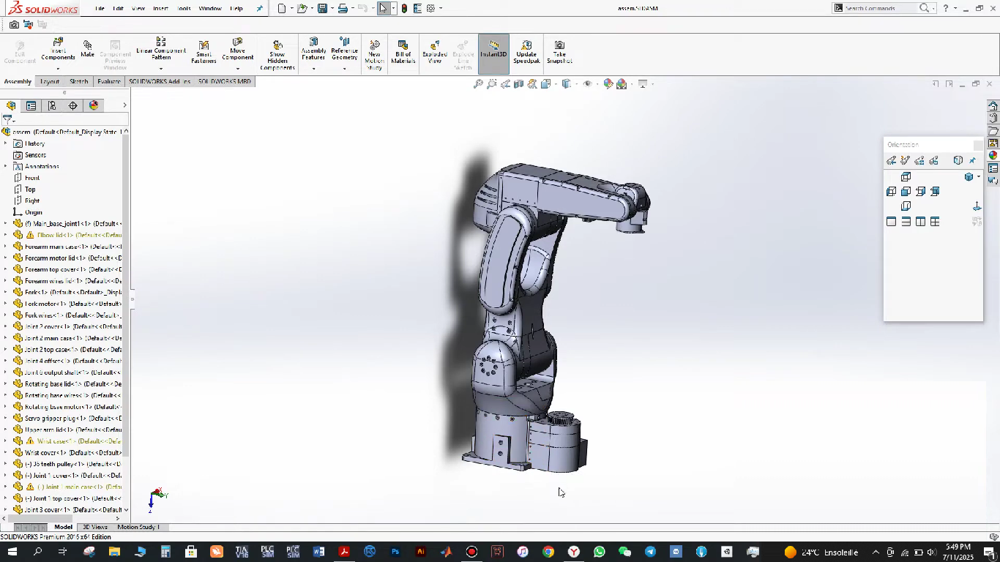
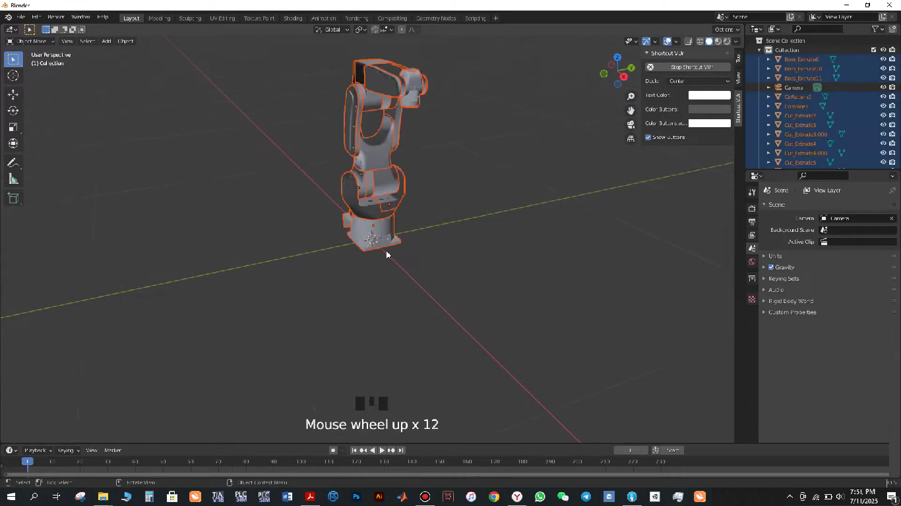

# 🤖 Faze4 Robotic Arm Simulator Ξ Unity & MATLAB Co-Simulation


[](https://github.com/BrahimOeh)
[](https://unity.com)
[](#)
<a href="https://mathworks.com">
  
</a>
[](https://mathworks.com)

---

## 🎯 Overview

A **real-time robotic arm simulation** of the **Faze4 industrial arm** inside Unity, **controlled via MATLAB** over a **local TCP socket server**.

This behavioural simulation mimics a robotic picking system using:
🛠️ **Unity + Blender + SolidWorks**

📡 **TCP/IP communication between MATLAB & Unity**

📈 **Real-time MATLAB data visualization**

---

## 🖼️ Modeling & Rigging Workflow

### 🧩 SolidWorks Design

by **Petar Crnjak** *https://github.com/PCrnjak/Faze4-Robotic-arm*

### 🌀 Blender Rigging


### 📷 Control & Simulation/Animation in Matlab + Unity

---

## 🗂️ Project Structure

```
Faze4-Robotic-arm-simulator/
├── MatlabProject/              ← MATLAB scripts for control & plotting
│    ├── color_check.m
│    ├── func_data.m
│    ├── func_grab.m
│    ├── image.png
│    ├── ImageReadTCP_One.m
│    ├── new_object.m
│    ├── Part3.m
│    ├── Part4.m
│    ├── TCPInit.m
│    ├── writeTCP.m
├── images/
│   ├── Solidworks.png    ← 3D Mechanical model
│   ├── Blender.png       ← Pivoting the joints and adjusting rotation axis
│                           for unity simulation in Blender
└── UnityProject/
    ├── Assets/                 ← 3D models, scripts, scenes, prefabs
    ├── Library/, Temp/, etc.  ← Auto-generated Unity cache files
```

---

## ⚙️ How It Works

### 🛠 Model Preparation

1. The mechanical design of the Faze4 robotic arm is first opened in **SolidWorks**.
2. The assembly is imported into **Blender** to reposition **joints’ pivot points** (rotation axes).
3. The rigged model is then exported as `.FBX` and imported into Unity.

### 🧠 Control System

* **MATLAB** sends joint angle commands over a **TCP socket**.
* **Unity C# scripts** listen to this stream and animate the arm accordingly.
* A Unity **simulation scene** visually reflects the movement.

### 🎨 Color Detection Simulation

* The arm picks up colored cubes placed randomly.
* The **"color sensor"** is simulated by detecting collisions between the **picker head** and cubes.
* Once color is detected, it's **sent back to MATLAB**, which:

  * **Plots it in real-time**.
  * Tracks the number and order of picked cube colors.

---

## 🧪 Demo Scenarios

| Scenario              | Description                                                     |
| --------------------- | --------------------------------------------------------------- |
| 🟥 Color Cube Pickup  | Arm moves to red, green, or blue cubes and picks them in a loop |
| 📡 Bidirectional Data | Data transfer: MATLAB → Unity (command), Unity → MATLAB (color) |
| 📊 Real-Time Plotting | MATLAB figure updates instantly on cube detection               |

---

## 🚀 Features

* ✅ TCP/IP socket communication using C# and MATLAB
* ✅ Real-time animation in Unity using `Transform.RotateAround`
* ✅ Cube detection with Unity's **Physics + Collider system**
* ✅ Color classification and dynamic data plotting in MATLAB
* ✅ Modular folder structure & reusable scripts

---

## 📷 Video Showcase

> *Linkedin : ---*
>
> Includes screen-recorded clips of:

* The arm moving according to MATLAB commands
* Unity's game scene view with animated joints
* Cube detection and response
* MATLAB color plot updating in real-time


## 🧠 Tech Stack

* Unity (Game engine, 3D rendering, collision)
* C# (Behavioural Animation & Scripted TCP socket communication)
* MATLAB (Computation, plotting, command generation)
* Blender (Model pivot setup)
* SolidWorks (Original 3D model)

---

## 💡 Future Work

* Integrate inverse kinematics via MATLAB
* Improve UI for selecting tasks in Unity
* Expand to include conveyor belt or camera vision module

---

## 📄 License

This project is licensed under the [MIT License](LICENSE).

---

